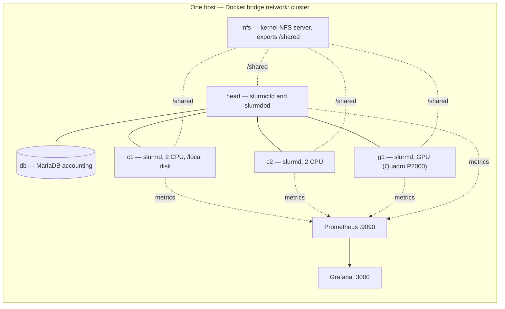
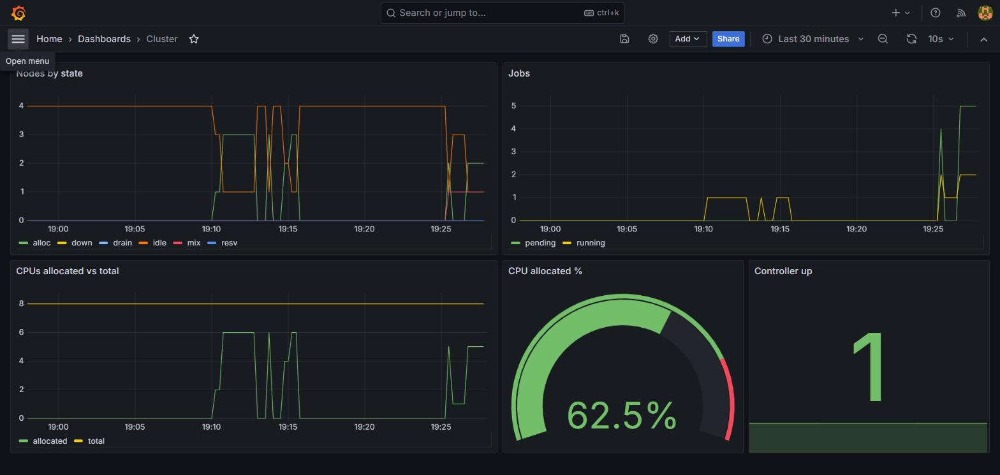
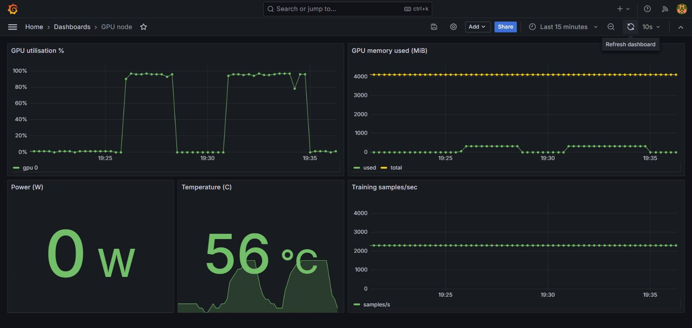
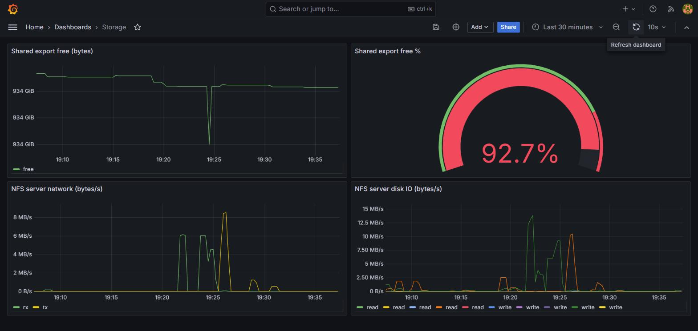

<h1 align="center">mini-hpc-ai-cluster</h1>

<p align="center">
  <strong>A production-shaped Slurm cluster on a single machine.</strong><br>
  A scheduler with accounting, fair share and limits · one real NFS export · a GPU node ·
  Prometheus and Grafana · and a runbook of failures caused on purpose and then diagnosed.<br>
  Brought up, configured and tested with one command.
</p>

<p align="center">
  <a href="https://github.com/Mojtaba-Alehosseini/mini-hpc-ai-cluster/actions/workflows/ci.yml"></a>
  
  
  
  <a href="LICENSE"></a>
</p>

---

This repository stands up a small but real HPC cluster and operates it the way a shared
system is operated. Every "node" is a container on one Docker bridge network, but the
things that make a cluster hard are the real thing: Slurm 23.11 with a MariaDB accounting
database, cgroup v2 confinement of job steps, a kernel NFS server exporting one shared
file system to every node, a GPU scheduled as a generic resource, monitoring with
unit-tested alert rules, several users with separate accounts, and a set of induced
failures with their diagnoses.

The point is not the toy scale. It is that the whole thing is **reproducible** (`make up`
builds, starts and configures it; `make check` proves it), **measured** (every number in
the docs comes from a command in this repository), and **honest** about its seams (a table
below states exactly what is real and what is emulated).

## Highlights

- **Scheduler that behaves like a shared system.** Accounting in a real database, fair
  share across accounts, per-user QoS limits, and cgroup v2 memory and CPU confinement of
  every job step — each demonstrated by an acceptance test and a runbook incident.
- **One real shared file system.** A kernel NFS server exports a single volume mounted at
  `/shared` on every node, with a benchmarked comparison against node-local disk.
- **A scheduled GPU.** A Quadro P2000 is presented to Slurm as `gres/gpu`; a short CNN
  training run drives it to 99 % utilisation as a live load for the dashboards.
- **Monitoring with tested alerts.** Prometheus scrapes node, Slurm and GPU exporters;
  Grafana ships three provisioned dashboards; five alert rules each have a promtool unit
  test that runs in CI.
- **Configuration as code, and idempotent.** The container images carry only packages;
  Ansible installs the munge key, the Slurm configuration, the users and the accounts, and
  starts the daemons — a second run reports no change.
- **A real runbook.** Ten failures are induced on purpose (bad GRES device, munge key
  mismatch, out-of-memory kill, accounting outage, idle-GPU waste, and more) and each is
  captured with its real diagnostic output.

## Architecture



The compute nodes are pinned to disjoint CPU sets and capped with Docker CPU and memory
limits, so they behave like differently sized machines. Only `c1` carries a node-local
disk (`/local`), which the storage benchmark compares against `/shared`.

## Quickstart

Requires a Linux host (or WSL2) with Docker Engine; for the GPU node, an NVIDIA GPU with
the NVIDIA Container Toolkit. Full setup notes, including WSL2, are in
[`docs/SETUP.md`](docs/SETUP.md).

```bash
make up          # build images, start the containers, configure with Ansible, wait for idle nodes
make check       # run the 14 acceptance tests in tests/run.sh
make bench       # IO and small-file benchmarks -> bench/results/*.csv
make report      # regenerate docs/report.md from those CSVs
make idempotent  # a second Ansible run in check mode; must report no change
make down        # stop the containers, keep the volumes
make reset       # stop and delete everything, including volumes
```

Once `make up` finishes, the monitoring stack is on the host at
**http://localhost:9090** (Prometheus) and **http://localhost:3000** (Grafana,
`admin` / `admin-throwaway`).

## What is real, and what is emulated

| Real | Emulated |
|---|---|
| Slurm 23.11 with slurmdbd accounting, fair share and QoS limits | Nodes are containers on one kernel, not separate machines |
| cgroup v2 confinement of job steps (memory and CPU) | The `cluster` network is a Docker bridge, not a switched fabric |
| Kernel NFS server; `/shared` is one export mounted on every node | Node sizes are Docker CPU and memory limits |
| One Pascal GPU (Quadro P2000, 4 GB) scheduled as a Slurm GRES | Nodes run privileged (for NFS mount, cgroups and the GPU) |
| Apptainer runs job containers on the nodes | One physical host, one clock |
| Prometheus + Grafana, three dashboards, five unit-tested alert rules | On WSL the GPU is `/dev/dxg`, so it does not enter an Apptainer container |

## Results

A run on the development machine (Quadro P2000, Docker on WSL2). Every figure is generated
by `scripts/gen_report.py` from the CSVs under `bench/results/`; the full write-up is
[`docs/report.md`](docs/report.md).

- **Shared storage.** Sequential write to `/shared` (NFS) is about **72 MB/s** against
  **313 MB/s** to a node-local disk — the expected cost of one server behind a bridge.
- **Small files — the headline for AI datasets.** On `/shared`, reading a dataset as tar
  shards is about **12× faster** than as loose 4 KiB files (46 vs 3.7 MB/s), and NFS
  creates small files roughly **10× slower** than local disk (54 vs 670 files/s). Pack
  datasets into shards.
- **Scheduler.** Over-memory jobs are killed `OUT_OF_MEMORY`, over-time jobs `TIMEOUT`,
  the per-user QoS cap holds, and fair share lifts an under-served account (pending
  priority 15000 vs 7500). Real output in [`runbook/RUNBOOK.md`](runbook/RUNBOOK.md).
- **GPU.** A CNN training job scheduled through Slurm `gres/gpu` drives the P2000 to
  **99 % utilisation** at about **2290 samples/s** (161 MiB peak GPU memory) on synthetic
  64×64 images.

## Real workloads on the cluster

Beyond the acceptance tests, the cluster runs real HPC workloads through Slurm.
The full write-up, with commands and tables, is in
[`docs/hpc-on-the-cluster.md`](docs/hpc-on-the-cluster.md).

- **A kernel suite across paradigms.** The six kernels of the external
  [`hpc-patterns`](https://github.com/Mojtaba-Alehosseini/hpc-patterns) suite
  (heat, ising, kmeans, lj, cg, fft) build in a node container and run through
  Slurm as serial, OpenMP and four-rank MPI jobs across both compute nodes —
  every run passing its correctness check, including a million-unknown
  conjugate-gradient solve. Reproduce: `scripts/run_hpc_patterns.sh`.
- **IOR and mdtest, built from source.** The standard HPC IO benchmarks confirm
  the storage story: a direct-IO write to `/shared` is about **2.9× slower** than
  to local disk (93 vs 269 MiB/s), and metadata is the real cost — NFS creates
  small files roughly **310× slower** and removes them **~1900× slower** than
  local disk. Reproduce: `bench/io/ior_mdtest.sh`.

## Monitoring

Prometheus scrapes a node exporter on every node, a Slurm exporter on the head node, and a
GPU exporter on `g1`. Grafana is provisioned with three dashboards (Cluster, GPU node,
Storage). Five alert rules fire on real conditions — a node down, a node Slurm cannot
reach, a job holding the GPU below 10 % utilisation, a stuck queue, and shared storage
running low — and every rule has a promtool unit test in
[`monitoring/prometheus/alerts.test.yml`](monitoring/prometheus/alerts.test.yml) that runs
in CI.

The dashboards during a live run — the cluster scheduling MPI jobs, the GPU node
under a training job, and the shared storage moving data:





## Repository layout

```
compose.yaml          the cluster: nfs, db, head, c1, c2, g1, prometheus, grafana
docker/node/          one image for every node; entrypoint and supervisord configs
ansible/              inventory, site.yml and the roles that configure the nodes
slurm/                slurm.conf, cgroup.conf, gres.conf, slurmdbd.conf (source of truth)
storage/              the NFS exports file
containers/           Apptainer image definition and the GPU job scripts
monitoring/           Prometheus config + alerts, the exporters, Grafana dashboards
runbook/              RUNBOOK.md and induce/verify scripts for ten incidents
bench/                IO and small-file benchmarks (fio, IOR/mdtest); results/ holds the CSVs
scripts/              wait_ready.sh, gen_report.py, run_hpc_patterns.sh; host/ has WSL2 setup
tests/run.sh          the 14 numbered acceptance tests
docs/                 SETUP.md, DECISIONS.md, report.md, hpc-on-the-cluster.md, figs/
.github/workflows/    CI: shell, Python, compose, Ansible and alert-rule checks
```

## How it is built

The images are deliberately thin: they carry packages, not state. Ansible
([`ansible/site.yml`](ansible/site.yml)), running over the Docker connection, installs the
munge key, writes the Slurm and NFS configuration, creates the users and the accounting
hierarchy, mounts `/shared`, and starts the daemons under supervisord. The playbook is
idempotent — `make idempotent` runs it again in check mode and must report no change,
which is one of the acceptance tests.

## Documentation

- [`docs/SETUP.md`](docs/SETUP.md) — host prerequisites and setup, including WSL2.
- [`docs/DECISIONS.md`](docs/DECISIONS.md) — the design decisions and their reasons.
- [`docs/report.md`](docs/report.md) — the measured write-up (generated from the data).
- [`docs/hpc-on-the-cluster.md`](docs/hpc-on-the-cluster.md) — real workloads run on the cluster (kernels, IOR/mdtest, and the dashboards under load).
- [`runbook/RUNBOOK.md`](runbook/RUNBOOK.md) — the ten induced incidents and their diagnoses.
- [`bench/README.md`](bench/README.md) — how the benchmarks are run and read.

## Licence

Released under the [MIT Licence](LICENSE).
